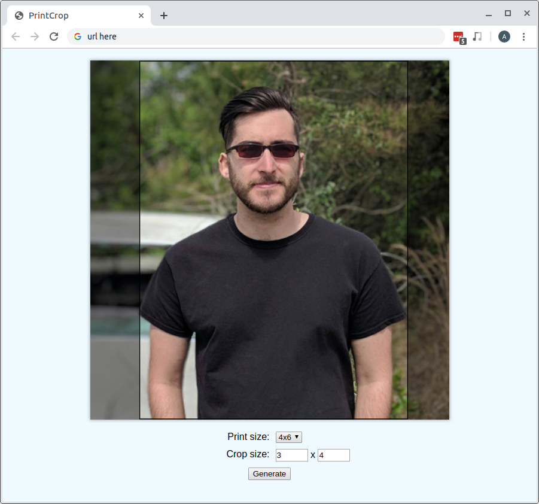

# printcrop

This small application helps you print out images for a scrapbook. Suppose you can only print glossy photos at certain resolutions, e.g. 4x6, 5x7, etc., but your pictures need to be arbitrary sizes for your scrapbook, e.g. 3.75x2.54. This tool allows you to pick an image, specify how large you want it to be, and then specify the size of the print. Using this information, it generates a padded, cropped image for you to print out. It even lets you drag around a cropping region so that, if your image is not the right aspect ratio, you can still cut it out in the right shape.

Here's an example of an image that the application might produce.

